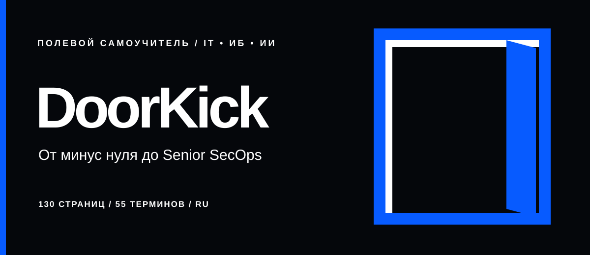

<div align="center">
  
</div>

<div align="center">

**Полевой самоучитель по IT и кибербезопасности — от минус нуля до Senior SecOps.**

[Открыть сайт проекта](https://invinby.github.io/doorkick/) · [Скачать PDF](DoorKick_Hardcore_BLUE_COMPLETE.pdf) · [Читать Markdown](DoorKick_Hardcore_COMPLETE.md)

`130 страниц` · `Русский` · `PDF + Markdown` · `White / Black / Electric Blue`

</div>

---

DoorKick — большая практическая книга для тех, кто хочет разобраться в компьютерах, сетях, программировании и информационной безопасности без прыжка сразу в терминальные заклинания. Сначала собираем фундамент, затем учимся видеть систему глазами защитника и проверять её только в разрешённой лаборатории.

В тексте сохранён авторский разговорный язык. Технические понятия объясняются простыми словами, через жизненные примеры, команды, небольшие фрагменты кода и типовые ошибки.

## Забрать книгу

| Формат | Для чего |
| --- | --- |
| [Полная книга PDF](DoorKick_Hardcore_BLUE_COMPLETE.pdf) | Читать на экране или печатать; 130 страниц, кликабельное оглавление |
| [Редактируемая рукопись](DoorKick_Hardcore_COMPLETE.md) | Искать, цитировать и предлагать правки |
| [Сборщик PDF](DoorKick_Hardcore_build.py) | Пересобрать книгу из Markdown |
| [Лицензия](LICENSE) | Условия распространения |

## Маршрут

| Раздел | Что внутри |
| --- | --- |
| **0 · Словарь** | 55 ключевых терминов: IP, DNS, SIEM, EDR, LLM и другие |
| **1 · Фундамент** | Компьютер, Linux и Windows, терминал, сети, OSI, TCP/IP, DNS, HTTP и HTTPS |
| **2 · Скриптинг** | Python, сетевые основы на Python, Bash и автоматизация |
| **3 · Blue Team** | Логи, сетевой трафик, hardening, firewall и Zero Trust |
| **4 · Red Team** | Разведка и веб-безопасность в лаборатории, уязвимости и повышение привилегий |
| **5 · ИИ в ИБ** | Prompt injection, защита LLM-приложений, API и анализ кода |
| **6–7 · Практика и разбор** | Социальная инженерия, моделирование, инциденты и постмортемы |
| **Финал · Senior SecOps** | Как связать активы, телеметрию, детекты, реакцию и улучшения в цикл |

## Визуальный язык

Чёрный задаёт рамку, белый оставляет текст читаемым, а яркий синий отмечает действия, схемы и ключевые точки. Обложка и схемы нарисованы плоскими векторными формами: без градиентов, фотореализма и декоративного шума. На сайте есть короткая анимация входящего импульса; системная настройка `prefers-reduced-motion` отключает движение.

## Безопасная практика

Все примеры тестирования предназначены для систем, которыми ты владеешь, или на которые у тебя есть явное разрешение. Для практики используй локальные учебные стенды и CTF. Не запускай сканирование, эксплуатацию уязвимостей или социальную инженерию против чужих систем и людей.

## Пересобрать PDF

Нужны Python, `reportlab`, `pypdf` и шрифты Arial, Georgia и Consolas. Из корня репозитория:

```powershell
python -m pip install -r requirements.txt
python DoorKick_Hardcore_build.py
```

Готовый файл появится как `DoorKick_Hardcore_BLUE_COMPLETE.pdf`. Для сборки в другой системе проверь пути к установленным шрифтам в скрипте.

## Правки и лицензия

Нашёл опечатку или хочешь уточнить объяснение — создай issue или pull request с источником и коротким обоснованием. Лицензия указана в [`LICENSE`](LICENSE).

<div align="center">

**Сначала пойми систему. Потом проверяй. Потом чини.**

</div>
